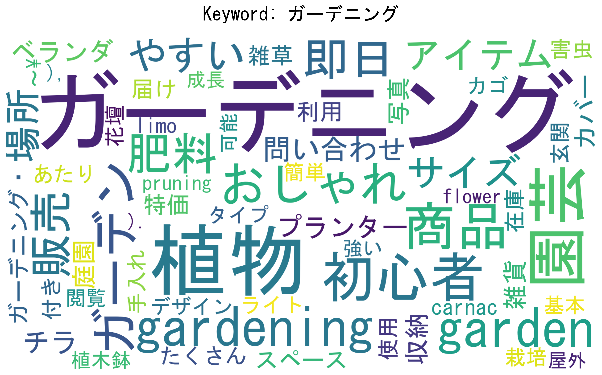
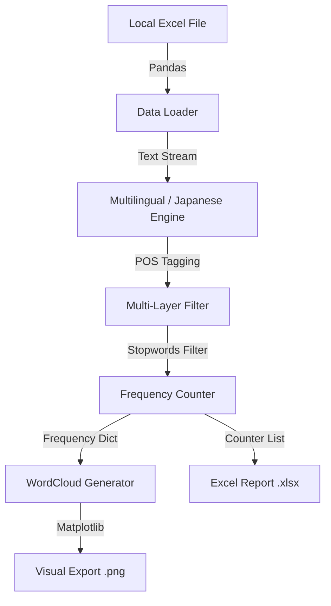

# WordCloud from Excel Generator

## 📖 Overview

**WordCloud Architect** is a versatile, high-performance text analysis engine designed to transform local Excel databases into high-impact visual insights. While it works seamlessly with Western languages (English, Portuguese, etc.), it is uniquely equipped with advanced **Japanese Natural Language Processing (NLP)** capabilities.

The core challenge of Japanese text—the lack of spaces between words—is handled by an integrated **Morphological Analysis** module using the Janome library. This allows the engine to segment continuous text into meaningful units, ensuring professional-grade word clouds and statistical reports regardless of the language.

### 🖼️ System Preview

<div align="center">
  
  <p><em>Japanese Example of a high-definition output for the "ガーデニング" keyword.</em></p>
</div>

<div align="center">
  
  <p><em>English Example of a high-definition output for the "Gardening" keyword.</em></p>
</div>

---

## 🌟 Key Features

* **Universal WordCloud Generation:** Effortlessly process any `.xlsx` file by pointing to the desired text and keyword columns.
* **Advanced Japanese Module:** Uses `Janome` for deep morphological analysis, accurately extracting Nouns (名詞) and Adjectives (形容詞) from non-spaced text.
* **Local-First & Secure:** Operates entirely on your local machine. No internet, cloud APIs, or Google Sheets credentials required.
* **Smart Stopword Filtering:** Integrated support for an external `stopwords.txt` file (UTF-8) to eliminate noise across multiple languages simultaneously.
* **Automated Data Reporting:** Automatically exports a comprehensive frequency report (`.xlsx`) containing the top 300 terms for each analyzed keyword.
* **Professional CJK Rendering:** High-fidelity font management ensures Japanese characters are displayed perfectly (no "tofu" blocks).
* **Safe Filename Sanitization:** Automated regex cleaning to ensure generated images are saved correctly, even if keywords contain illegal OS characters.

## 🔄 Workflow Logic



## 🛠️ Project Structure

```text
wordcloud_from_excel/
├── input/                     # Source Data
│   ├── your_database.xlsx     # Source Excel files
│   └── stopwords.txt          # Custom filter list (UTF-8)
├── output/                    # Generated clouds and reports
├── venv/                      # Python virtual environment
├── generate_wordcloud.py      # Core Logic
├── requirements.txt           # Project dependencies
└── README.md                  # Documentation
```

## 🚀 Quick Start

### Prerequisites

* **Python 3.9+**
* **CJK Font:** For Japanese support, ensure you have a compatible font (e.g., `msgothic.ttc` on Windows or `NotoSans` on Linux).

### Installation & Deployment

1. **Clone the Repository**

2. **Initialize Virtual Environment**

    ```bash
    python -m venv venv
    # Activate (Windows)
    .\venv\Scripts\activate
    # Activate (Unix)
    source venv/bin/activate
    ```

3. **Install Dependencies**

    ```bash
    pip install -r requirements.txt
    ```

4. **Execute Analysis**

    ```bash
    python generate_wordcloud.py
    ```

## 📘 NLP Strategy & Logic

### 1. The Tokenization Challenge

In Japanese, text is a continuous stream. The **WordCloud Architect** acts as a "Linguistic Chef", slicing the text stream based on morphological rules. It prioritizes:

* **名詞 (Nouns):** To capture the core subjects.

* **形容詞 (Adjectives):** To capture sentiments and qualities.

### 2. Multi-Layer Noise Reduction

The engine applies four distinct filters:

1. **Grammatical Filter:** Removes particles (助詞) and auxiliary verbs (助動詞).

2. **Internal Dictionary Filter:** Standard Japanese stopword sets.

3. **External User Filter:** Processes `stopwords.txt` to remove custom noise (e.g., "PDF", "Click", "Views").

4. **Structural Filter:** Removes single-character tokens and numeric strings.

---

## ⚖️ License (CC BY-NC 4.0)

This project is licensed under the **Creative Commons Attribution-NonCommercial 4.0 International License**.

[](http://creativecommons.org/licenses/by-nc/4.0/)

---

## 👨‍💻 Author

Rubens Braz
